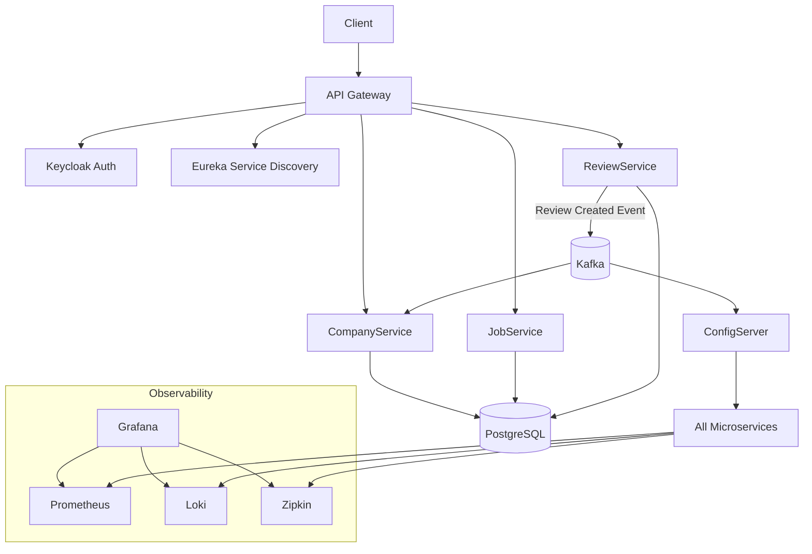

# 💼 Job Application Microservices Platform

Production-like microservices-based job application platform built with Spring Boot and Java, designed following modern distributed system principles.

The system implements a distributed architecture including API Gateway, service discovery, centralized configuration, event-driven communication, resilience patterns, security, and a full observability stack. The infrastructure is fully containerized using Docker and additionally supports Kubernetes deployment using Helm charts and automation scripts.

## ⚡ Quick Start

### Docker environment

Make sure Docker is running, then:

```bash
git clone https://github.com/leoga/jobapp-microservices-application
cd jobapp-microservices-application/deploy/docker
docker compose up -d
```

---

### Kubernetes environment (Minikube)

Make sure Docker Desktop, Minikube, kubectl, and Helm are installed.

Start the full Kubernetes environment:

```bash
cd deploy/k8s
./start.sh
```

This deploys:

- Infrastructure
- Microservices
- Monitoring stack
- Logging
- Tracing
- Grafana dashboards

It will enable the following URLs:

```text
👉 Gateway:   http://localhost:8080
👉 Keycloak:  http://localhost:8443
👉 Grafana:   http://localhost:3000
```

---

### Kubernetes without observability stack

To start only the infrastructure and microservices:

```bash
./start-microservices.sh
```

It will enable the following URLs:

```text
👉 Gateway:   http://localhost:8080
👉 Keycloak:  http://localhost:8443
```

---

### Stop Kubernetes environment

```bash
./stop.sh
```

## 🏗️ Architecture & Key Features

This project follows a microservices architecture where each service is independently deployable, loosely coupled, and owns its data.

### Core architecture components

- **API Gateway**: Central entry point for routing, filtering, and security
- **Service Discovery**: Dynamic service registration and discovery using Eureka
- **Centralized Configuration**: Externalized configuration managed via Spring Cloud Config (configuration loaded from an external configuration [repository](https://github.com/leoga/app-configuration/tree/main/jobapp-microservices))
- **Event-Driven Communication**: Asynchronous communication using Apache Kafka
- **Dynamic Configuration Updates**: Spring Cloud Bus powered by Kafka
- **Database per Service**: PostgreSQL database dedicated to each microservice to ensure loose coupling
- **Security**: OAuth2 authentication and authorization using Keycloak with PKCE flow
- **Resilience**: Fault tolerance implemented with Resilience4j (Circuit Breaker, Retry, and Rate Limiter patterns)
- **Observability**:
  - Metrics via Prometheus
  - Centralized logging with Loki and Promtail
  - Distributed tracing via Zipkin
  - Monitoring dashboards with Grafana
- **Containerization**: Full Docker-based environment
- **Kubernetes Support**:
  - Helm chart deployment
  - ServiceMonitor integration for Prometheus
  - Automated deployment scripts
  - Namespace isolation
  - Native Kubernetes service discovery

### Additional Resources

- Keycloak realm backup included
- Postman collection included for endpoint testing

## 📦 Deployment Structure

### Docker deployment

All Docker-related configuration is located in:

```text
jobapp-microservices/deploy/docker-job
```

### Kubernetes deployment

All Kubernetes-related configuration is located in:

```text
jobapp-microservices/deploy/k8s
```

Including:

- Helm charts
- Infrastructure manifests
- Monitoring stack
- Deployment automation scripts

---

### Key Docker files

- docker-compose.yml → Full platform
- docker-compose-without-app-services.yml → Infrastructure only

---

### Key Kubernetes scripts

- start.sh → Full Kubernetes environment
- start-microservices.sh → Infrastructure + microservices only
- stop.sh → Stops Kubernetes environment

📌 Run Docker commands from `deploy/docker-job`

📌 Run Kubernetes commands/scripts from `deploy/k8s`

## 🐳 Containerization Strategies

The platform supports three different ways to build and run microservices containers.

👉 The default and recommended approach in this project is **Google Jib**.

### 1️⃣ Dockerfiles (classic approach)

Provides full control over the image. After building the projects, execute:

```bash
docker compose build
```

Or this command to build and run the images all at once:

```bash
docker compose up --build -d
```

Inside docker-compose.yml choose this option in every microservice:

```yaml
build: ../../configserver
```

---

### 2️⃣ Spring Boot Buildpacks

Generates OCI images without a Dockerfile.

Inside docker-compose.yml choose this option in every microservice:

```yaml
image: jobapp/config-server
```

This must match the name provided in the pom.xml file of every project.

Notes:

- Uses Paketo Buildpacks
- No Dockerfile required
- Requires additional configuration for health checks:

```text
THC_PATH=/actuator/health
THC_PORT=8889
```

---

### 3️⃣ Google Jib (recommended)

Optimized for fast builds and CI/CD pipelines.

Inside docker-compose.yml choose this option in every microservice:

```yaml
image: leogatf/jobapp-config-server
```

This follows this structure:

```text
image: <docker-hub-user>/<image-name>
```

This must match the name provided in the pom.xml file of every project.

Notes:

- `jib:build` pushes images directly to a registry without requiring a Docker daemon
- `jib:dockerBuild` builds the image locally and requires Docker to be running

---

#### Push to Docker Hub

```bash
./mvnw clean compile jib:build
```

Requirements:

```bash
docker login
```

---

#### Build directly into local Docker

```bash
./mvnw clean compile jib:dockerBuild
```

Requirements:

- Docker Desktop must be running

---

### 📊 Comparison

| Approach   | Pros                          | Cons             | Use case        |
| ---------- | ----------------------------- | ---------------- | --------------- |
| Dockerfile | Full control                  | More maintenance | Custom builds   |
| Buildpacks | No Dockerfile, simple         | Less flexible    | Quick setup     |
| Jib        | Fast, no Docker daemon needed | Requires config  | CI/CD pipelines |

## ⚙️ Build Automation

Scripts are provided to automate builds and deployments.

### Docker scripts

- build-projects.sh
- build-projects-buildpack.sh
- build-projects-jib-build.sh
- build-projects-jib-docker-build.sh

### Kubernetes scripts

- start.sh
- start-microservices.sh
- stop.sh

Important:

- These scripts require a Unix-like environment
- Use Git Bash on Windows or any Linux/macOS terminal

## 🚀 Running the Platform

### Docker - Full platform

```bash
docker compose up -d
```

---

### Docker - Infrastructure only

```bash
docker compose -f docker-compose-without-app-services.yml up -d
```

This starts:

- PostgreSQL
- Kafka
- Keycloak
- Observability stack

But NOT the microservices, allowing you to run them from your IDE.

---

### Kubernetes - Full platform

```bash
cd deploy/k8s
./start.sh
```

It will enable the following URLs:

```text
👉 Gateway:   http://localhost:8080
👉 Keycloak:  http://localhost:8443
👉 Grafana:   http://localhost:3000
```

---

### Kubernetes - Microservices only

```bash
./start-microservices.sh
```

It will enable the following URLs:

```text
👉 Gateway:   http://localhost:8080
👉 Keycloak:  http://localhost:8443
```

## 📊 Observability Stack

Integrated into both Docker Compose and Kubernetes deployments.

### Components

- Grafana
- Prometheus
- Loki
- Promtail
- Zipkin

### Features

- Centralized logs
- Distributed tracing
- Metrics collection
- ServiceMonitor integration
- Grafana dashboards

### Default access

- Grafana → http://localhost:3000
- Zipkin → http://localhost:9411
- Gateway → http://localhost:8080
- Keycloak → http://localhost:8443

All services are preconfigured as Grafana data sources.

## 🔄 System Flow

1. Client → API Gateway
2. Gateway → Keycloak (OAuth2 + PKCE)
3. Gateway → Eureka (service discovery)
4. Microservices communication:
   - REST (synchronous)
   - Kafka (asynchronous)
5. Review events → Company service
6. Config updates → Kafka (Spring Cloud Bus)
7. Observability stack collects logs, metrics, and traces

## 🔐 Security

- OAuth2 authentication via Keycloak
- PKCE flow
- Centralized authentication at API Gateway
- Token propagation handled at Gateway level

A Keycloak realm backup is included.

## 🔧 Configuration

### PostgreSQL

```text
jdbc:postgresql://localhost:5432/jobapp
```

### Keycloak

After importing the realm backup, create a user with the admin role.

- http://localhost:8443
- user: admin
- password: admin

## 📚 API Documentation

For more details about available endpoints, see [API_DOCUMENTATION.md](API_DOCUMENTATION.md)

## 🧩 Architecture Diagram



## 🛠️ Technologies

- Spring Boot 4.0.5
- Spring Cloud 2025.1.1
- Java 26
- PostgreSQL 18
- Kafka
- Docker & Docker Compose
- Kubernetes
- Helm
- Minikube
- Prometheus
- Grafana
- Loki
- Zipkin
- Jib & Buildpacks
- Maven

### Additional dependencies

- Lombok
- MapStruct
- Spring Data JPA (Hibernate/JPA)

## 💡 Why this project

This project was initially inspired by a training course and later evolved into a platform that demonstrates how to design and implement a production-like microservices architecture, incorporating real-world features and architectural improvements, including:

- Distributed system patterns
- Kubernetes deployment
- Observability (metrics, logs, tracing)
- Helm-based infrastructure management
- Multiple containerization strategies (Dockerfile, Buildpacks, Jib)
- Secure API exposure using OAuth2 and PKCE
- Event-driven communication with Kafka
- Build and deployment automation scripts

It is intended as a portfolio project to showcase real-world backend architecture skills.

## 👤 Author

Leoga
